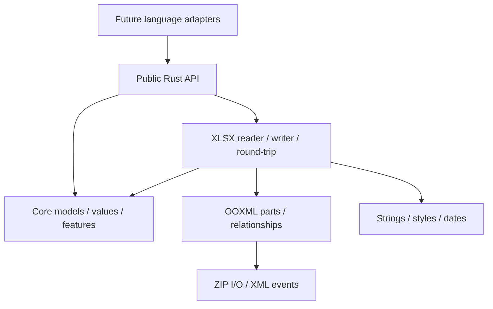

# Architecture

Status: first M1 numeric streaming checkpoint implemented. The goal is a standalone Rust crate with full public openpyxl feature coverage, improved processing speed, and controlled memory consumption. Language bindings are deferred. Current ownership and resource decisions are recorded in [ADR 0001](decisions/0001-numeric-streaming.md).

## Reference scope

The initial openpyxl architecture review used directory/module names and documentation only, without reading implementation or reconstructing internal call graphs. The user later authorized narrowly reviewing important pending merge-request diffs and necessary surrounding code. Findings are in [the MR review](openpyxl-mr-review.md).

- Architecture reference checkout: Mercurial `52c77fdee169`, default branch.
- Compatibility baseline: openpyxl 3.1.5, tag revision `13627b03ca25a1a98becf40e533b955615b13429`; M0 must complete the public-feature inventory against this version.
- Sources: README, development, optimized modes, performance, formula, date/time, pivot, and feature documentation.
- Documentation: https://openpyxl.readthedocs.io/en/stable/ . Default-branch documentation may differ from the release baseline.

## openpyxl feature boundaries

| Boundary | Reference packages | Responsibility |
|---|---|---|
| User-facing model | workbook, worksheet, cell | Workbook, sheets, cells, ranges, properties |
| Read/write coordination | reader, writer, workbook/worksheet codecs | Loading, saving, and worksheet modes |
| File format | packaging, xml | OOXML parts, relationships, content types, XML |
| Types and utilities | utils, descriptors, compat | Coordinates, dates, type descriptions, Python compatibility |
| Styles and rules | styles, formatting, worksheet feature modules | Formatting, validation, filtering, tables |
| Advanced content | chart, drawing, chartsheet, comments, pivot | Charts, images, comments, pivot data |
| Formula tools | formula | Tokenization and reference translation; not a calculation engine |
| Tests | tests within feature packages | Module-level behavior and interoperability fixtures |

The public documentation distinguishes a general editable model, lazy read-only iteration, and sequential write-only output. These boundaries are useful; Python descriptors and compatibility scaffolding do not need one-to-one Rust equivalents.

## Design decisions

- Preserve the complete public feature baseline. Staged implementation changes delivery order, not final scope.
- Clone, pin, inspect, port, and refactor selected calamine/rust_xlsxwriter modules. Do not build the core as a wholesale wrapper or re-export of those libraries.
- Use mature foundational ZIP, XML, date, and temporary-file crates as normal dependencies.
- Share a single value, formula, style, address, error, and feature model across readers and writers.
- Internals may use ownership, borrowing, enums, traits, iterators, builders, and typed IDs extensively. Public Rust names and syntax may differ, but functionality and observable semantics must meet openpyxl expectations.
- Binding adapters can map call names and language-specific behavior later; they must not have to reconstruct missing core spreadsheet capabilities.
- Correctness, memory use, and performance are joint acceptance criteria. Avoid unnecessary allocation, copying, and per-cell metadata duplication, and measure relevant changes.

## Workspace

```text
openrsxl/
├── Cargo.toml
├── crates/
│   ├── openrsxl/              # Public Rust facade and prelude
│   ├── openrsxl-core/         # Shared types, editable model, feature models
│   └── openrsxl-xlsx/         # ZIP/OOXML, readers, writers, preservation
├── tests/fixtures/
├── benchmarks/
├── third_party/               # Port provenance and required notices
└── docs/
```

The three workspace crates now exist. Tests currently generate small OOXML fixtures in memory rather than storing a binary fixture directory. Dependencies flow from facade to XLSX to core; the facade also exposes core types. Start with modules and split additional crates only when useful.



### Core

- Values and addresses: empty, number, text, boolean, spreadsheet error, date/time semantics; typed zero-based row/column indices with explicit A1 parsing and formatting.
- Formulas: text, typed cached value, shared/array/dynamic metadata; tokenizer and translation later.
- Styles: shared style tables and typed IDs; no separate incompatible reader/writer style systems.
- Editable model: sparse Workbook/Worksheet/Cell storage, names, merged ranges, sheet properties, and structural editing.
- Feature models: tables, filters, validation, conditional formatting, comments, drawings, charts, pivots, protection, document properties.
- Batches: values separated from optional metadata, actual row/column positions, owned batches and useful borrowed views.
- Errors and limits: one matchable error vocabulary with part/location context and explicit resource budgets.

### XLSX

- Package: archive access, content types, relationship graph, normalized part resolution; never assume sheet1.xml or a fixed workbook path.
- XML: event-based decoding/encoding, namespaces, escaping, shared number/text rules; no full-sheet DOM.
- Metadata, strings, styles, dates: decode and encode the same core types, loading only what is needed.
- Reader: row/batch streaming and explicit full-model loading built on the same cell decoder.
- Writer: streaming output and editable-model output using the same encoders and feature serializers.
- Parts: feature-specific decoders/encoders separated from public models.
- Round-trip: original part inventory, dirty tracking, reuse of unchanged parts, and synchronized relationships/content types.

### Public API and future adapters

Separate WorkbookReader, WorkbookWriter, and editable Workbook capabilities. Use concrete types, Result, fallible iterators, and builders rather than dynamic arguments. Keep I/O independent of foreign runtimes and document index conventions, ownership, close/finish/abort, cancellation, and cleanup. Provide safe owned handle/batch paths alongside borrowing; do not introduce unsafe or a stable C ABI merely for hypothetical bindings. Declare only supported Send/Sync properties.

## Port allocation

The following allocations describe the overall port plan. Numeric package/cell/coordinate parsing is the first completed subset, traced in [ports.json](../third_party/ports.json). Remaining allocations are candidates. Exact source revisions are recorded in [upstream sources](upstream-sources.md).

| Upstream | Destination | Refactoring |
|---|---|---|
| calamine datatype/formats | Core values, XLSX date/style codecs | Shared value and format semantics |
| calamine xlsx/mod.rs and cells_reader.rs | Package metadata, reader, strings, part codecs | Reuse cell parsing; emit rows/batches; move Range collection to explicit materialization |
| calamine errors/utils | Core errors/addresses, XLSX helpers | One coordinate/error convention; remove duplication |
| calamine vba.rs | Macro metadata and preservation | Reuse relevant XLSX behavior without importing unrelated formats |
| rust_xlsxwriter workbook/worksheet | Core models and XLSX writer | Separate model, validation, encoding, I/O; port constant-memory path |
| rust_xlsxwriter format/styles/datetime/formula/shared strings | Shared models and codecs | Unify reader/writer representation and IDs |
| rust_xlsxwriter packager/relationships/content types/XML writer | XLSX package/XML | Shared part graph and serialization rules |
| rust_xlsxwriter charts/drawings/images/tables/rules/notes | Core feature models and XLSX parts | Pair serializers with readers and editing support |
| Upstream tests/examples | Focused regression fixtures and benchmarks | Retain provenance; validate this project's public behavior |

Port coherent modules, retain mature algorithms, and integrate them into one architecture. Additional parser gaps require targeted source evaluation or implementation.

## Memory strategy

The user requires both intelligent automatic allocation and explicit memory budgets, with advanced tuning. More available RAM should enable measured faster strategies, such as bounded caches, larger useful batches, indexing, or independent-sheet parallelism; low RSS is not the objective by itself. The first numeric policy is implemented in [ADR 0002](decisions/0002-adaptive-memory.md): scan streams; repeated access samples and materializes if its estimate fits the policy allowance, with budget fallback. It accounts for effective Linux availability, container/process constraints and headroom, with explicit budget and advanced overrides. Cache/concurrency strategies remain open. `ResourceLimits` and operation budgets are not a global process RSS ceiling. `input_buffer_bytes` remains explicit because its larger settings showed little benefit. `read_sheet` explicitly materializes a bounded numeric snapshot through the same decoder; this is separate from the later full editable workbook model.

Read ZIP metadata, select a worksheet, stream decompression/XML events, decode selected cells, and produce bounded rows/batches. Validate entry lifetimes without solving ownership by buffering an entire worksheet.

- Bound buffers/batches by bytes and cell/row count; retain sparse positions and expand only explicitly requested finite rectangles.
- Budget shared strings; large-string completion requires a disk-backed index and bounded cache, not only an out-of-memory-limit error.
- Account for metadata and styles; they are not inherently constant-sized.
- Editable models may scale with loaded data, while lazy parts, shared IDs, and dirty tracking reduce duplication.
- Port the writer's constant-memory/temporary-file approach, document mode-specific restrictions, and measure temporary storage and I/O. Full feature coverage must remain available through appropriate modes.
- Numeric streaming targets metadata plus I/O buffers plus one row/batch rather than memory proportional to total rows. User-retained batches are additional memory.

Initial Rust source inspection confirms calamine already has a low-level cell reader. Its Range collection and eager workbook-level strings/styles still require separate analysis. rust_xlsxwriter's documented constant-memory mode flushes rows to temporary files and restricts editing earlier rows; its low-memory mode still keeps unique shared strings in RAM.

## Complete round-trip

Readers plus writers do not automatically provide safe modification of existing files. Preserve original part inventory, unknown subtrees, namespace context, binary content, and references. Rebuild affected parts only, synchronizing styles/strings IDs, formulas, relationships, and content types. Opaque preservation is a separate capability from reading/creating/editing a feature. Reject unsupported destructive edits rather than silently dropping content. Signed-document behavior needs an explicit policy.

## Benchmark evidence

The earlier feasibility benchmark compared openpyxl and calamine only. Current openrsxl measurements use a reproducible three-scale numeric experiment with checksums, raw runs, wall time, and kernel peak RSS; see [benchmark evidence](../benchmarks/README.md). Results apply to raw numeric streaming, not the future full-feature library or bindings.
